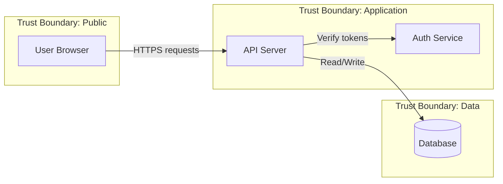

# Stage 1 — System Model

**Four Question Framework question:** *What are we working on?*

This stage establishes the comprehensive application model that every later stage builds on. The components, data flows, and trust boundaries you document here are the exact targets that Stage 2 analyzes for threats, so breadth of coverage matters more than implementation depth — you're mapping the system, not reviewing the code line by line.

**Deliverable:** write your analysis to `01-system-model.md` in the output directory (default `threatmodel/`).

## Mode framing

How you gather the model depends on the mode:

- **from-code** — Analyze the actual repository in the working directory. Treat the code, configuration, and infrastructure definitions as the source of truth; use any docs present to corroborate.
- **from-docs** — The system may not be built yet. Build the model from design material instead. Discover what exists locally (README, `docs/`, specs, PRDs, RFCs, plan files) and read it; if the invoker pointed you at external context (ticket IDs, Confluence/Linear links) and the matching MCP servers are available, fetch that first. Distinguish clearly between what the design commits to and what is still undecided.
- **pair** — Build the model collaboratively. Draft what you can from available material, then ask the human targeted questions to fill gaps (intended users, sensitive data, deployment, external integrations). Confirm the model before advancing.

## Analysis areas

Cover each of these:

1. **Application purpose and scope** — the business problem solved, intended users and stakeholders, key workflows, domain/industry context, and the critical operations that depend on the system.
2. **Technology stack** — languages and framework versions, web/app servers and middleware, datastores/caches/queues, notable third-party libraries and their roles, build/CI tooling, cloud services and deployment targets.
3. **Data flows** — ingestion points (user input, API calls, uploads, webhooks), processing/transformation, storage, output channels, data exchanged with external systems, and the sensitive data types handled (PII, credentials, financial, health).
4. **Actors and assets** — user roles and their capabilities (anonymous, authenticated, admin, service), external systems that interact with the app, data assets classified by sensitivity, infrastructure assets (servers, containers, secret stores), and business-logic/IP assets.
5. **Trust boundaries** — where trust levels change: network boundaries, authentication boundaries (unauth vs. auth), authorization boundaries (role transitions), process boundaries (client/server, service borders), third-party boundaries (data leaving your control), and data-classification boundaries.
6. **Entry points** — every way external entities interact: HTTP/HTTPS endpoints (REST, GraphQL, web pages, webhooks), WebSockets/real-time channels, CLIs and management consoles, queue consumers and event handlers, filesystem interfaces (uploads, config, logs), database and admin interfaces, inter-service channels.
7. **External dependencies** — third-party APIs and SaaS, identity providers (OAuth/SAML/SSO), cloud platform services, CDN/edge, monitoring/logging/alerting, payment and financial integrations.
8. **Deployment context** — architecture style (monolith, microservices, serverless, hybrid), orchestration/runtime, environment tiers, network topology and segmentation, secrets management, scaling and availability characteristics.

If the invoker supplied business or security objectives, use them as reference points to guide and validate your analysis — but still investigate independently and note any discrepancies between the stated objectives and what you actually find.

## Note the system's nature for downstream reference selection

As you build the model, explicitly record whether the system **exposes HTTP APIs**, **integrates an LLM/AI model**, or **has a mobile client**. These characteristics determine which OWASP reference checklists later stages consult (API, LLM, Mobile), so calling them out here makes Stage 2's reference selection accurate. If none apply beyond a standard web surface, say so.

## Investigation approach

Work in three passes:

- **Documentation and configuration** — READMEs and docs, API specs, package manifests, deployment configs (Dockerfiles, Kubernetes, Terraform, CI/CD), environment/config schemas.
- **Architecture and data layer** — entry points, routing, middleware; database schemas, migrations, models; data-access patterns; authentication and authorization mechanisms.
- **Integration and business logic** — service-to-service communication, external API integrations, core business workflows, event handling and async processing.

In `from-docs` mode, substitute the equivalent design artifacts for code where the code doesn't exist yet.

## Data flow diagrams

Produce at least one Mermaid data flow diagram showing major components and their interactions, data flows labeled with what is transmitted, trust boundaries as subgraphs, and external entities and data stores. Use `flowchart`/`graph` syntax, for example:

Add more diagrams if the architecture warrants (e.g. deployment topology, per-feature data flow, or authentication flow).

## Output

Write `01-system-model.md` with clear top-level sections for each analysis area and the Mermaid DFD(s) in the appropriate section.

**Quality standards:**

- Support findings with specific evidence — file paths, configuration values, code patterns (in `from-docs` mode, cite the design documents instead).
- Distinguish confirmed findings from reasonable inferences, and flag where information is incomplete or needs further investigation.
- Prioritize breadth — a complete map of the system — over implementation detail.

Every component, data flow, and trust boundary you capture here will be systematically analyzed in Stage 2, so a gap here becomes a blind spot there.
